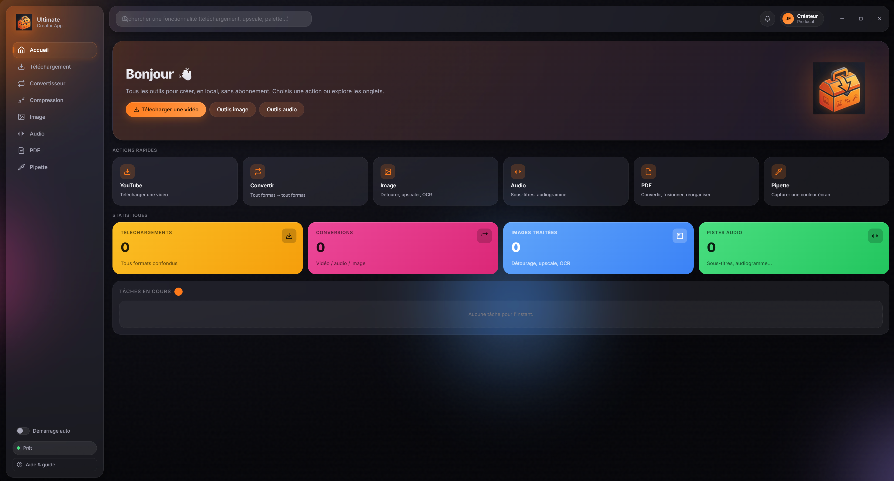
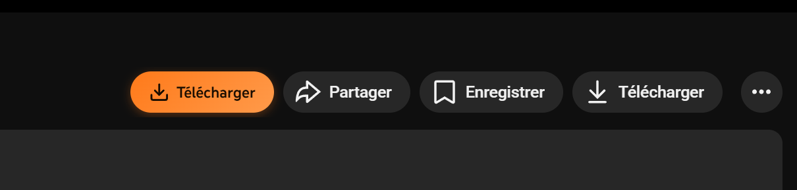

# Ultimate Creator App

> L'app tout-en-un pour les créateurs de contenu. **100 % en local**, gratuite, sans abonnement, sans envoyer tes fichiers sur Internet.


*<sub>Remplace ce screenshot par une capture de l'app au premier lancement</sub>*

---

## ✨ Fonctionnalités

### 🎬 Téléchargement YouTube
- Tous formats : **MP4, MKV, WebM, MOV, AVI, MP3, WAV, FLAC, M4A, Opus, AAC**
- Toutes qualités jusqu'en **8K (4320p)**
- **Timeline scrubber** : couper précisément avec preview du player YouTube
- **Mode batch** : coller plusieurs URLs, téléchargement en parallèle
- **Téléchargement de la miniature HD** en 1 clic

### 🔄 Convertisseur universel
- Vidéo, audio, image — tout format vers tout format
- Support **HEIC** (photos iPhone) → JPG/PNG/WebP
- Format **AVIF** moderne
- Mode "extraire l'audio uniquement"

### 🗜️ Compression
- Vidéo : 3 préréglages (Léger / Moyen / Fort) + mode avancé (CRF, bitrate, résolution, fps)
- Image : compression intelligente type **TinyPNG**, gain typique 60-80 %, batch ok

### 🖼️ Outils image (6 modes)
- **Détourage IA** : modèle ML local U²-Net → PNG transparent
- **Upscaler** : Real-ESRGAN ×2/×3/×4, photos et anime
- **Palette couleurs** : 5 couleurs dominantes en HEX/RGB/HSL/CMJN
- **OCR** : reconnaissance de texte (Tesseract.js, FR + EN)
- **Compression** : batch d'images avec aperçu du gain
- **Effacer un objet** : brosse un élément, l'algorithme le fait disparaître

### 🔊 Outils audio (5 modes)
- **Auto-trim** : coupe automatique des silences (idéal podcast)
- **Normaliser** : volume aux normes pro (YouTube -14 LUFS, Spotify, Apple…)
- **Crossfade** : fondu enchaîné entre 2 fichiers
- **Sous-titres IA** : Whisper (local) → SRT/VTT, 8 langues, modèles tiny → medium
- **Audiogramme** : vidéo waveform animée pour Insta/TikTok/YouTube
- **Résumé YouTube** : transcription Whisper + résumé via **Ollama** (LLM local)

### 📄 Outils PDF
- PDF → Images (JPG/PNG/WebP, DPI réglable)
- Images → PDF (combiner)
- Fusionner plusieurs PDF
- Diviser par plages
- **Réorganiser visuellement** : drag & drop des miniatures, suppression de pages

### 🎨 Pipette globale
- Capture une couleur **n'importe où à l'écran** (page web, vidéo, autre app)
- Loupe ×8 avec zoom pixel-perfect
- HEX/RGB/HSL/CMJN copiés instantanément
- Historique des 16 dernières couleurs

### 🌐 Extension navigateur (Chrome / Edge / Opera / Brave)
- Bouton orange **"Télécharger"** injecté sur YouTube
- **Adblock configurable** : pubs YouTube (skip auto), pubs web, popups, trackers
- Communication sécurisée avec l'app via serveur local

---

## 🚀 Installation

### Windows (le plus simple)

1. Va sur la page **[Releases](https://github.com/espinjulian005-lgtm/ultimate-creator-app/releases)** du projet
2. Télécharge `Ultimate.Creator.App.Setup.x.x.x.exe`
3. Lance l'installeur — l'app démarre automatiquement à la fin

> ⚠️ Windows SmartScreen peut afficher "App non reconnue" car l'app n'est pas signée commercialement. Clique **"Informations complémentaires"** → **"Exécuter quand même"**.

### macOS

1. Télécharge `Ultimate.Creator.App-x.x.x.dmg` depuis [Releases](https://github.com/espinjulian005-lgtm/ultimate-creator-app/releases)
2. Glisse l'icône dans le dossier Applications
3. Premier lancement : **clic-droit** → "Ouvrir" pour contourner Gatekeeper

### Linux

```bash
chmod +x Ultimate-Creator-App-x.x.x.AppImage
./Ultimate-Creator-App-x.x.x.AppImage
```

### Installation depuis les sources (pour développeurs)

```bash
git clone https://github.com/espinjulian005-lgtm/ultimate-creator-app
cd ultimate-creator-app
# Windows :
.\install.ps1
npm start
# macOS / Linux :
chmod +x install.sh && ./install.sh
npm start
```

---

## 🌐 Installer l'extension navigateur

L'extension est dans le dossier `extension/`.

1. Lance Ultimate Creator App (l'extension dialogue avec elle)
2. Ouvre `chrome://extensions` (ou `edge://`, `opera://`, `brave://`)
3. Active **Mode développeur** en haut à droite
4. Clique **Charger l'extension non empaquetée**
5. Sélectionne le dossier `extension/`
6. Va sur YouTube — un bouton orange "Télécharger" apparaît


*<sub>Capture du bouton sur YouTube</sub>*

### Configurer l'adblock

Clique sur l'icône orange UC dans la barre Chrome → toggle les bloqueurs :

- **Pubs YouTube** + **Skip auto** → fini les pubs avant/pendant les vidéos
- **Pubs générales (web)** → bloque DoubleClick, Taboola, Outbrain…
- **Popups & popunders** → bloque les ouvertures non sollicitées
- **Trackers (mode strict)** → bloque GA, Hotjar, Mixpanel… (désactivé par défaut)

---

## 🤖 Activer le résumé YouTube avec Ollama (optionnel)

Le résumé de vidéos YouTube nécessite **Ollama** — un service local qui fait tourner les LLM (comme ChatGPT, mais sur ta machine, gratuit, hors-ligne).

1. Télécharge Ollama : https://ollama.com
2. Installe-le (l'icône lama apparaît dans le system tray)
3. Ouvre **un nouveau** PowerShell, tape :
   ```powershell
   ollama pull llama3.2
   ```
4. Attends que le modèle se télécharge (~2 GB, une seule fois)
5. Retourne dans Ultimate Creator → Audio → Résumé YouTube → le bandeau passe en vert

Modèles recommandés (au choix) :
- `llama3.2` (2 GB) — rapide, bon en français
- `mistral` (4 GB) — meilleure qualité, lent sur CPU
- `qwen2.5:3b` (1.9 GB) — léger, multilingue

---

## 💡 Tips d'utilisation

### Garde l'app prête en arrière-plan
Active le toggle **Démarrage auto** dans la sidebar. Au démarrage de Windows, l'app se lance silencieusement dans le system tray (icône lama orange en bas à droite). Quand tu cliques le bouton de l'extension sur YouTube, elle remonte d'un coup avec l'URL pré-remplie.

### Ferme proprement
- **Croix X** = réduire dans le system tray (l'app continue de tourner)
- **Clic-droit sur l'icône tray → Quitter** = fermer complètement

### Multi-URL queue
Onglet Téléchargement → toggle **"Lot (multi-URLs)"** → colle 50 URLs d'un coup → choisis le format → "Lancer la queue". Les téléchargements s'enchaînent (concurrence réglable de 1 à 4).

### Coller une image (Ctrl+V)
Dans les onglets **Image (Détourage / Palette / OCR)**, fais juste `Ctrl+V` après avoir copié une image (capture d'écran, image depuis le web…). L'app la traite directement.

---

## 🛠️ Dépannage

| Problème | Solution |
|---|---|
| `ollama : terme non reconnu` | Ferme et rouvre PowerShell après l'install d'Ollama |
| L'extension dit "App non détectée" | Lance Ultimate Creator App d'abord. Vérifie que l'icône lama orange est dans le system tray |
| L'erreur **`ffmpeg introuvable`** | Lance `install.ps1` depuis le dossier de l'app |
| L'erreur **`Real-ESRGAN n'est pas installé`** | Lance `install.ps1` (télécharge le binaire ~50 MB) |
| Whisper "ne télécharge pas le modèle" | Vérifie ta connexion. Le 1er usage télécharge ~75 MB (modèle tiny) à ~1.5 GB (medium) |
| YouTube affiche "Erreur 153" sur certaines vidéos | Le créateur a désactivé l'embed externe. Le téléchargement marche quand même, juste pas le scrubber timeline. Utilise le mode "tronçon manuel" |
| L'.exe ne se lance pas (SmartScreen) | Clic-droit sur l'.exe → Propriétés → onglet Général → cocher "Débloquer" |

---

## 🏗️ Architecture technique

- **Frontend** : Electron (Chromium + Node.js) avec UI HTML/CSS/JS pure (zéro framework)
- **Téléchargement** : [yt-dlp](https://github.com/yt-dlp/yt-dlp) (référence open source)
- **Conversion / Compression** : [ffmpeg](https://ffmpeg.org/) + [sharp](https://sharp.pixelplumbing.com/) pour les images
- **Détourage IA** : [@imgly/background-removal-node](https://github.com/imgly/background-removal-js)
- **Upscaling IA** : [Real-ESRGAN-ncnn-vulkan](https://github.com/xinntao/Real-ESRGAN)
- **OCR** : [tesseract.js](https://github.com/naptha/tesseract.js)
- **Speech-to-Text** : [whisper.cpp](https://github.com/ggerganov/whisper.cpp) via [nodejs-whisper](https://github.com/ChetanXpro/nodejs-whisper)
- **PDF** : [pdf-lib](https://pdf-lib.js.org/) + [pdfjs-dist](https://mozilla.github.io/pdf.js/) + [@napi-rs/canvas](https://github.com/Brooooooklyn/canvas)
- **LLM (résumés)** : [Ollama](https://ollama.com) via API HTTP locale

---

## 🤝 Contribuer

Issues, suggestions et PR bienvenues. Pour ajouter une feature :

1. Fork le repo
2. Crée une branche `feat/ma-feature`
3. Code dans le respect du style existant (pas de framework UI, juste HTML/CSS/JS)
4. Ouvre une PR avec captures d'écran si pertinent

---

## 📜 Licence

MIT — fais-en ce que tu veux. Mention "Built with Ultimate Creator" appréciée si tu redistribues.

---

## 🙏 Remerciements

L'idée initiale vient du repo open source [ayoub-laroussi/youtube-downloader](https://github.com/ayoub-laroussi/youtube-downloader-master). Tout le reste a été construit en élargissant l'ambition : ne plus avoir à payer 5 abonnements différents pour faire son taf de créateur.
